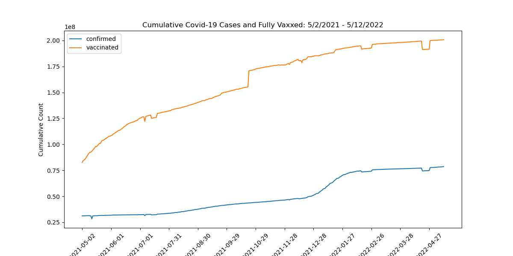

# Covid-19-Study

### Problem Statement
Covid-19, a novel coronavirus, was first identified in December 2019 in Wuhan China.  It quickly spread throughout Asia and the rest of the world; transmitted by inhalation of droplets and particulates exhaled by infected individuals.  Early transmissibility estimates put the basic reproduction number, R0, between 1.4 and 2.5.  However, unknown at the time, later analysis would estimate an R0 between 3.8 and 8.9.  The rapid spread of the virus, and severity of the resulting illness, hit countries hard overwhelming local hospitals and leaving government officials with more questions than answers on how to address the emerging and evolving health crisis.  This led to a wide disparity in strategy's, from China's "zero Covid" to Sweden's "let it rip".  

In an effort to provide clarity in future pandemic health crisis, this study aims to provide a set of tools to help inform policy makers on the correct course of action.  These tools include:

- Through inferential analysis, identify factors that lead to viral spread thereby influencing policy decisions.
- Model virus spread to correct and/or substantiate data from other countries.
- Create a forecasting model to better project future cases enabling a proactive mindset.

### Methodology
All datasets on Google's Covid-19 Open Data platform was downloaded and analyzed.  For the purpose of this analysis six datasets were chosen to use going forward: index, demographics, health, vaccinations, government response, weather, and the target dataset epidemiology.  Each of the six datasets were analyzed for features to use and features to drop.  A time based dataset was created starting with the time based data sets vaccinations, government response, weather and epidemiology then merging the location based datasets index, demographics and health on a county level location key shared by all datasets. Seperately, these same six datasets were used to create three merged datasets set by date; 01-01-2021 representing the start of the data and pre-vaccine rollout, 09-01-2021 representing mid-dataset and after vaccine rollout, and 05-13-2022 representing the last day of good data across all datasets.  All datasets used and created can be found here: https://drive.google.com/drive/folders/1JiD5cMormt_FQtjzU61m3eNeZH917_nX?usp=share_link.

Correlation analysis was performed on the three single day datasets to check colinearity and drop highly correlated features.  The time series data was used to generate the following chart of vaccination rollout with the number of cumulative Covid cases.

The time series data was then grouped by state and the last day of good data was isolated.  With this dataframe cases/person, deaths/person, and vaccinations/person features were calculated to normalize the data in order to compare states directly.  Histograms were created for each ratio feature.

Three different approaches were used for modeling the datasets.  First, inferential analysis was applied to the linear regression models of each of the three single day datasets to identify those factors which contribute the most to confirmed cases increasing or decreasing.  Second, four regression models, RidgeCV, LasoCV, KNN, and RandomForest were used to model confirmed cases with RidgeCV chosen as the best performer.  Lastly, the epidemiology dataset was used to create two forecast models, a simple 10 lag autoregression model and an ARIMA auto-arima optimized model. 

### Conclusions/Recommendations
This study set out to develop a set of tools that will help policy makers better address future health crisis as they arise and evolve.  To accomplish this task three models were developed to manage different issues.  

First, inferential analysis on linear regression models were used to identify factors that contribute to the spread of the virus both pre and post vaccine rollout. Population is by far the largest influence on the number of confirmed Covid cases.  Post vaccine rollout, cumulative_persons_fully_vaccinated is the next largest factor.  From a policy standpoint, as contact tracing, debt relief, workplace closings and facial coverings become more strict, cases were reduced.  Unexpectedly, as public events were cancelled and closed, confirmed cases actually increased.  As expected, as life expectancy increases confirmed cases decrease.  With weather factors, whatever drives people inside (rainfall increases, temperature increases in summer, temperature decreases in winter) increases confirmed cases.

Second, four regression models (RidgeCV, LasoCV, KNN, RandomForest) were tested to identify the best model to correct and/or substantiate pandemic spread data from other sources.  RandomForest had the best test scores but was massively overfit and took a long time to run.  RidgeCV performed well enough on both pre and post vaccine data with scores ~0.90 and ~0.96 respectively with quick turnaround on predictions.  Because of this, RidgeCV is our choice model for this application.

Third, forecast models were developed to predict future case numbers in order to proactively plan and implement policies.  A simple 10 lag autoregression model performed very well in the very short term.  For longer term forecasts an ARIMA model with auto-arima optimization was created.  In the short term this model was slightly off but still performed well given that the dataset is niether seasonal or stationary.

Recommendations: compile tools into a single dashboard, continue to optize models as data volume increases

### Sources
Coronavirus Icon Source: https://www.istockphoto.com/portfolio/YanaKostiuchyk
https://en.wikipedia.org/wiki/COVID-19_pandemic
https://medium.com/@mudassar_lhr/how-to-download-the-csv-file-from-url-using-python-650eae6d3478
GA 9.02-lesson-linear-ts-models
GA 9.04-lesson-forecasint-ii

Cloud Stored Datasets: https://drive.google.com/drive/folders/1JiD5cMormt_FQtjzU61m3eNeZH917_nX?usp=share_link

### Data Dictionary
|Feature|Type|Dataset|Description|
|---|---|---|---|
|** location_key**|*float64*|All Datasets|location index to link all datasets| 
|**date**|*date/time*|All Datasets|date index to link all time based datasets| 
|**school_closing'**|*float64*|government_response|Schools are closed (0-3)| 
|**workplace_closing'**|*float64*|government_response|Workplaces are closed (0-3)| 
|**cancel_public_events**|*float64*|government_response|Public events have been cancelled (0-3)| 
|**restrictions_on_gatherings**|*float64*|government_response|Gatherings of non-household members are restricted (0-3)| 
|**public_transport_closing**|*float64*|government_response|Public transport is not operational (0-3)| 
|**stay_at_home_requirements**|*float64*|government_response|Self-quarantine at home is mandated for everyone (0-3)| 
|**restrictions_on_internal_movement**|*float64*|government_response|Travel within country is restricted (0-3)| 
|**international_travel_controls**|*float64*|government_response|International travel is restricted (0-3)| 
|**income_support**|*float64*|government_response|Value of fiscal stimuli, including spending or tax cuts (0-3)| 
|**debt_relief**|*float64*|government_response|Debt/contract relief for households (0-3)| 
|** public_information_campaigns**|*float64*|government_response|Government has launched public information campaigns (0-2)| 
|**testing_policy**|*float64*|government_response|Country-wide COVID-19 testing policy (0-3)| 
|**contact_tracing**|*float64*|government_response|Country-wide contact tracing policy (0-2)| 
|**facial_coverings**|*float64*|government_response|Policies on the use of facial coverings outside the home (0-4)| 
|**vaccination_policy**|*float64*|government_response|Policies for vaccine delivery for different groups (0-5)| 
|**population**|*float64*|demographics|Total count of humans| 
|**population_male**|*float64*|demographics|Total count of males| 
|**population_female**|*float64*|demographics|Total count of females| 
|**population_age_00_09**|*float64*|demographics|Estimated population between the ages 00_09| 
|**population_age_10_19**|*float64*|demographics|Estimated population between the ages 10_19| 
|**population_age_20_29**|*float64*|demographics|Estimated population between the ages 20_29| 
|**population_age_30_39**|*float64*|demographics|Estimated population between the ages 30_39| 
|**population_age_40_49**|*float64*|demographics|Estimated population between the ages 40_49| 
|**population_age_50_59**|*float64*|demographics|Estimated population between the ages 50_59| 
|**population_age_60_69**|*float64*|demographics|Estimated population between the ages 60_69| 
|** population_age_70_79**|*float64*|demographics|Estimated population between the ages 70_79| 
|**population_age_80_and_older**|*float64*|demographics|Estimated population over the age of 80| 
|**life_expectancy**|*float64*|health|Average years that an individual is expected to live| 
|**average_temperature_celsius**|*float64*|weather|Recorded hourly average temperature| 
|**rainfall_mm**|*float64*|weather|Rainfall during the entire day| 
|**snowfall_mm**|*float64*|weather|Snowfall during the entire day| 
|**new_confirmed**|*float64*|epidemiology|Count of new cases confirmed after positive test on this date| 
|**new_deceased**|*float64*|epidemiology|Count of new deaths from a positive COVID-19 case on this date| 
|**cumulative_confirmed**|*float64*|epidemiology|Cumulative sum of cases confirmed after positive test to date| 
|**cumulative_deceased**|*float64*|epidemiology|Cumulative sum of deaths from a positive COVID-19 case to date| 
|** cumulative_persons_fully_vaccinated**|*float64*|vaccinations|Cumulative sum of persons which have received all doses required for maximum immunity| 
|** vax_pop_ratio**|*float64*|vaccinations|cumulative_persons_fully_vaccinated/population| 
|** cov_confirmed_pop_ratio**|*float64*|epidemiology|cumulative_confirmed/population| 
|** deceased_pop_ratio**|*float64*|epidemiology|cumulative_deceased/population| 

Data Sources: 
Oxford COVID-19 government response tracker CC BY License
United States Census Bureau (2019 Census) Public Domain
WorldBank CC BY License
NOAA https://www.ncei.noaa.gov
Covid Tracking Project (The Atlantic) CC BY License
CDC Public Domain

Above source data was compiled by google and available at https://health.google.com/covid-19/open-data/raw-data

